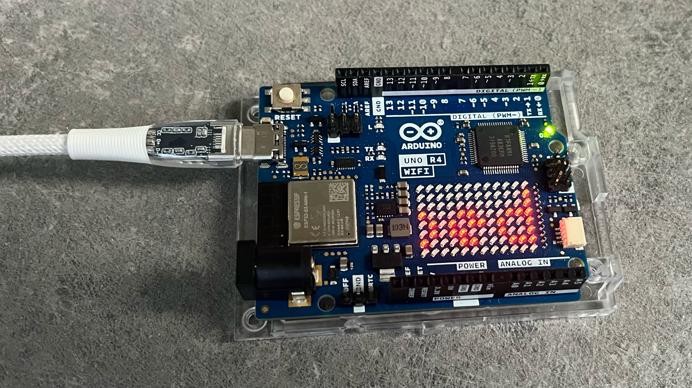

# Arduino UNO R4 WiFi — SQL to LED Matrix

A small project to scroll messages from a MariaDB/MySQL database on a server to the built-in LED matrix on the Arduino UNO R4 WiFi.

## Files

### arduino-messages.php
A PHP web dashboard for adding, editing, and deleting messages in the `arduino_messages` table in the MariaDB/MySQL database. Can be hosted on the same server as the database or on a separate web server.

### arduino-messages.sql
SQL file that creates the `arduino_messages` table in a MariaDB or MySQL database of your choice. Create a dedicated database user account for the Arduino to use.

### config.php
Database configuration file. Update this file with your database credentials before deploying the PHP dashboard.

### secrets.h
Arduino configuration file containing WiFi credentials and database connection settings. Update this file before uploading the sketch to your Arduino.

### style.css
Optional stylesheet for styling the PHP dashboard page.

### uno-r4-wifi-sql-to-matrix.ino
The main Arduino sketch. Import this file into the Arduino IDE together with `secrets.h`.

## Setup

### 1. Database Setup
- Run `arduino-messages.sql` to create the `arduino_messages` table in your MariaDB/MySQL database.
- Create a dedicated database user account with access to the table.
- Update `config.php` with your database credentials.

### 2. PHP Dashboard Setup
- Upload `arduino-messages.php`, `config.php`, and `style.css` to your web server.
- Open the dashboard in a browser to add, edit, or delete messages.

### 3. Arduino Setup
- Update `secrets.h` with your WiFi credentials and database connection details.
- Open `uno-r4-wifi-sql-to-matrix.ino` in the Arduino IDE.
- Make sure `secrets.h` is in the same Sketch folder.
- Upload the sketch to your Arduino UNO R4 WiFi.

## Usage
- Open `arduino-messages.php` in your browser to manage messages.
- The Arduino fetches messages from the database every 30 seconds and scrolls them across the LED matrix.

## Things to Remember
The `arduino-messages.php` dashboard currently has no authentication or access control. Anyone who knows the URL can view and modify messages. Consider adding a login mechanism if the dashboard is publicly accessible.

## Future Modifications
- **WiFi provisioning**: It would be useful to support dynamic WiFi configuration, allowing the Arduino to be used in locations with different networks (e.g. hotels) without re-flashing the firmware.
- **Dashboard security**: Adding basic authentication or a login page to the PHP dashboard.

## Changelog

### translate branch
- Translated all Dutch strings and comments to English in `uno-r4-wifi-sql-to-matrix.ino` and `arduino-messages.php`.
- Added library documentation block at the top of both files.
- Refactored `arduino-messages.php`: extracted database operations into documented functions (`connectToDatabase`, `addMessage`, `editMessage`, `deleteMessage`, `getMessages`).
- Added PHPDoc-style function comments to all functions in `arduino-messages.php`.
- Added Doxygen-style function comments to all functions in `uno-r4-wifi-sql-to-matrix.ino`.
- Updated `README.md` with improved setup instructions and changelog.
