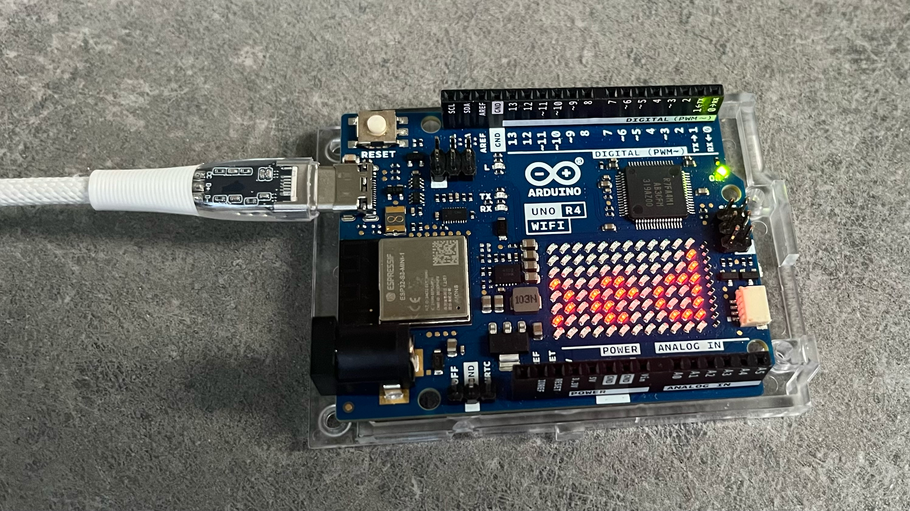

# Arduino UNO R4 Wifi SQL to LED Matrix
A small project to scroll messages from a MariaDB/MySQL database on a server to the LED Matrix on the Arduino UNO R4 Wifi, like the one I have and as shown below in the picture.

## Files
Here is the list of files, and a small description of what they do.

### arduino-messages.php
This small PHP script can add, edit, and delete messages in the `arduino_messages` table in the MariaDB/MySQL database server. In my case, the PHP file is on the same server as the database, but this is not necessary.

### arduino-messages.sql
This is the SQL file that creates the `arduino_messages` table in a MariaDB or MySQL database of your choice. Please create an account for the use of the table by the Arduino.

### config.php
The file that contains your database configuration. Please update as needed. It needs your database credentials for using the database.

### secrets.h
This is the personal configuration file. Here you need to add your WiFi credentials that the Arduino has to use, and the database information and database user account. Edit as needed.

### style.css
The stylesheet to style the PHP script page to edit the messages. This is optional but quite nice.

### uno-r4-wifi-sql-to-matrix.ino
This is the Arduino IDE file to import into your Sketch (together with the `secrets.h` file).

## Setup
1. **Database Setup**:
    - Use the `arduino-messages.sql` file to create the `arduino_messages` table in your MariaDB/MySQL database.
    - Update the `config.php` file with your database credentials.

2. **PHP Script Setup**:
    - Place the `arduino-messages.php` and `config.php` files on your server.
    - Ensure the server can connect to the database.

3. **Arduino Setup**:
    - Update the `secrets.h` file with your WiFi and database credentials.
    - Upload the `uno-r4-wifi-sql-to-matrix.ino` file to your Arduino UNO R4 Wifi.

## Usage
- Access the `arduino-messages.php` file through your web browser to add, edit, or delete messages.
- The Arduino will fetch these messages and display them on the LED matrix.

## Things to Remember
The `arduino-messages.php` file does not have any security measures for adding, editing, and deleting messages. So if someone knows the URL of the PHP file, they can see and edit the messages. Let me know if this needs to be addressed, or if you have a good solution, you can also let me know. Enjoy using your Arduino's, ESP32's, and all the other types of MCU's.

## Future Modifications
Maybe it would be a good option, if possible, to set a WiFi connection via a different way of provisioning the data so the Arduino could be taken to a hotel or place with public WiFi. Any ideas on how to do that will be appreciated.